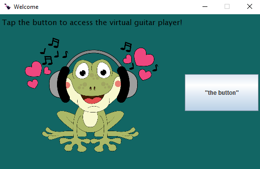
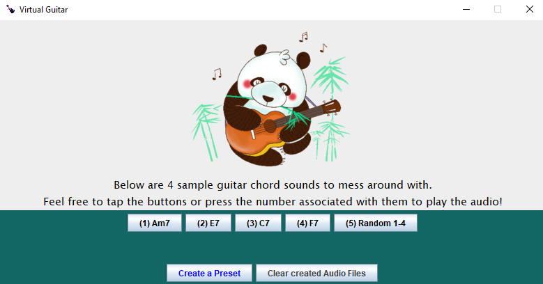

# virtual-guitar 🎸
A Java Swing application that provides .wav guitar audio files and allows custom presets to be created from them. 

Complete with the following: welcoming page, sample button panel linked to different .wav guitar audio files, create a preset process, remove a preset process, and an option to delete any user-created .wav audio files stored in the local directory.

## project-images 🖼️

 

